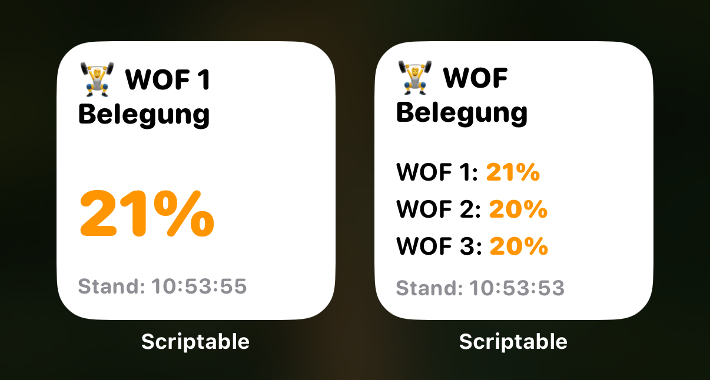
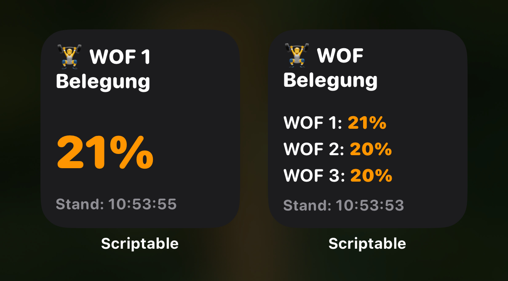

# WOF Belegung Widget

Ein Scriptable-Widget zur Anzeige der aktuellen Belegung der WOF Fitnessstudios.




## Funktionen

- Abrufen und Anzeigen der aktuellen Belegungsdaten von WOF Fitnessstudios
- Unterstützung für mehrere Studiofilialen (bis zu 3)
- Farbkodierung der Belegungsanzeige (grün, orange, rot) basierend auf dem Prozentsatz
- Offline-Modus mit Caching für Zeiten ohne Internetverbindung
- Automatische Aktualisierung der Daten alle 15 Minuten
- Datencache für bis zu 7 Tage

## Installation

1. Lade die [Scriptable App](https://apps.apple.com/de/app/scriptable/id1405459188) aus dem App Store herunter
2. Öffne Scriptable und erstelle ein neues Skript
3. Kopiere den Inhalt von `WOF Belegung v0.6.0.js` in das neue Skript
4. Gib dem Skript einen Namen (z.B. "WOF Belegung")
5. Füge das Widget zum Homescreen hinzu

## Widget-Konfiguration

Das Widget kann über die Widget-Parameter konfiguriert werden:

1. Halte das Widget auf dem Homescreen gedrückt
2. Wähle "Widget bearbeiten"
3. Tippe auf "Parameter"

### Parameter-Optionen

- Einzelnes Studio: Gib die Studionummer ein (z.B. `1` für WOF 1)
- Mehrere Studios: Gib die Studionummern durch Semikolon getrennt ein (z.B. `1;2;3`)

Ohne Parameter wird standardmäßig WOF 1 angezeigt.

## Anpassungsmöglichkeiten

Das Skript enthält folgende Konfigurationsoptionen, die im Code angepasst werden können:

```javascript
const config = {
  enableOfflineMode: true,    // Offline-Modus aktivieren/deaktivieren
  enableColorCoding: true,    // Farbkodierung der Belegungsanzeige
  enableTimestamp: true,      // Zeitstempel anzeigen
  defaultStudioNumber: 1,     // Standard-Studio
  runsInWidget: true          // Widget-Modus aktivieren/deaktivieren
};
```

## Cache-Management

- Die Daten werden lokal auf dem Gerät gespeichert
- Cache wird automatisch aktualisiert alle 15 Minuten
- Cache-Einträge älter als 7 Tage werden automatisch gelöscht
- Im Offline-Modus werden die letzten bekannten Daten angezeigt (max. 60 Minuten alt)

## Fehlerbehebung

Falls das Widget keine Daten anzeigt:

1. Prüfe deine Internetverbindung
2. Stelle sicher, dass die WOF-Website erreichbar ist
3. Prüfe, ob die angegebene Studionummer existiert
4. Öffne das Skript in der Scriptable App und führe es dort aus, um Fehlermeldungen zu sehen

## Versionshinweise

### v0.6.0
- Unterstützung für mehrere Studios im selben Widget
- Verbesserte Fehlerbehandlung
- Optimiertes Layout für verschiedene Widget-Größen
- Cache-Management mit automatischer Bereinigung

## Rechtliche Hinweise und Lizenz

Dieses Skript ist für den persönlichen Gebrauch bestimmt.

**Wichtiger Hinweis**: Dies ist **kein offizielles Produkt der Corpora Fitness GmbH & Co.KG** (Betreiber der WOF Fitnessstudios). Es handelt sich um ein inoffizielles, von Fans entwickeltes Tool, das öffentlich zugängliche Daten der WOF-Website verwendet.

Die Bezeichnung "WOF" und alle damit verbundenen Marken, Logos und Namen sind Eigentum der Corpora Fitness GmbH & Co.KG. Die Verwendung dieser Bezeichnungen in diesem Skript dient ausschließlich zu Identifikationszwecken.

### Haftungsausschluss

Dieses Skript wird ohne jegliche Gewährleistung bereitgestellt. Die Entwickler übernehmen keine Haftung für etwaige Schäden, die durch die Nutzung dieses Skripts entstehen könnten. Die Genauigkeit und Verfügbarkeit der angezeigten Daten hängt von der WOF-Website ab. 
